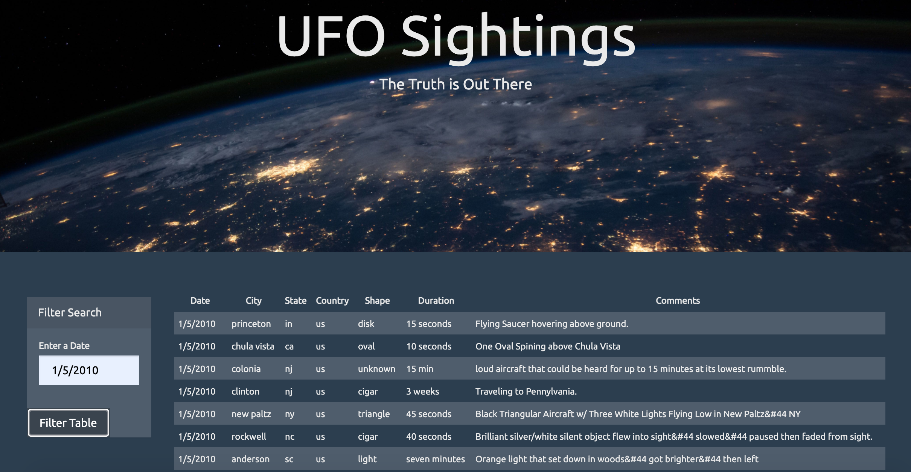
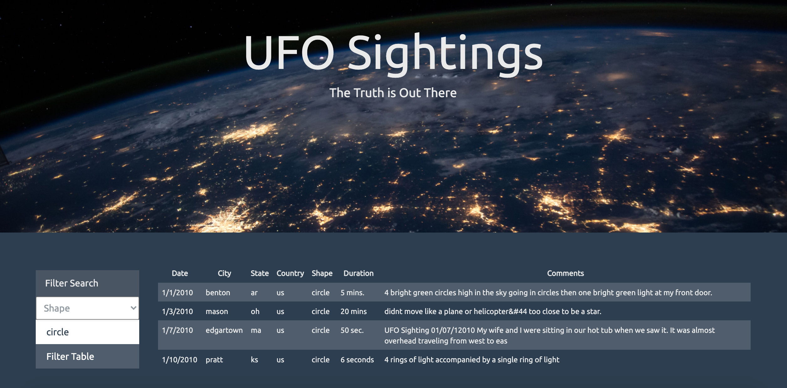

# javascript-challenge
_______________________________
**Objective**

_______________________________
***Level 1***
Using a UFO dataset, which is in the form of an array of Javascript objects, write code that appends a table to a basic HTML web page.  The code should append a table to the web page and adds new rows of data for each UFO sighting.  Include a listening event to search through the `date/time` column to find rows that match user input.

***Level 2***
Create select dropdowns and a Javascript code for the user to search with multiple filters.

_______________________________
